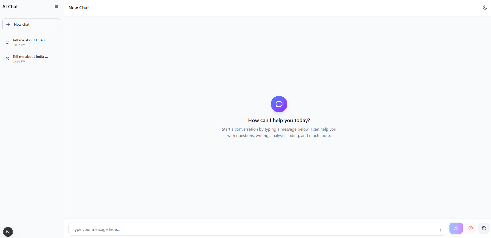

# AI SDK Chatbot



A full-featured AI chatbot built with Next.js, Google Gemini API, and Supabase. Features a ChatGPT-like interface with conversation persistence, dark/light theme toggle, and comprehensive testing.

## ✨ Features

- 🤖 **AI Chat Interface**: Full-featured chat with streaming responses
- 🎨 **Modern UI**: Beautiful ChatGPT-like interface with avatars and gradients
- 🌙 **Theme Support**: Light and dark mode with instant toggle
- 💾 **Persistence**: Conversation history saved to Supabase database
- 📱 **Responsive Design**: Works perfectly on desktop and mobile
- 🧪 **Comprehensive Testing**: Jest unit tests with 70%+ coverage
- ⚡ **Real-time Streaming**: Live AI responses with stop/regenerate controls
- 📝 **Markdown Support**: Rich text rendering with code syntax highlighting
- 🔄 **Conversation Management**: Create, delete, and switch between conversations

## 🚀 Tech Stack

- **Frontend**: Next.js 15, React 19, TypeScript
- **AI**: Google Gemini 2.5 Flash via AI SDK v5
- **Database**: Supabase (PostgreSQL)
- **Styling**: Tailwind CSS v4
- **Testing**: Jest, React Testing Library
- **Deployment**: Vercel-ready

## 📦 Installation

1. **Clone the repository**
   ```bash
   git clone <repository-url>
   cd ai-sdk-chatbot
   ```

2. **Install dependencies**
   ```bash
   pnpm install
   ```

3. **Set up environment variables**
   ```bash
   cp .env.local.example .env.local
   ```
   
   Fill in your environment variables:
   ```env
   GOOGLE_GENERATIVE_AI_API_KEY=your_gemini_api_key
   NEXT_PUBLIC_SUPABASE_URL=your_supabase_project_url
   NEXT_PUBLIC_SUPABASE_ANON_KEY=your_supabase_anon_key
   ```

4. **Set up Supabase database**
   
   Run the SQL schema in your Supabase SQL editor:
   ```sql
   -- See supabase-schema.sql for the complete schema
   CREATE TABLE ai_sdk_chatbot_conversations (
     id UUID DEFAULT gen_random_uuid() PRIMARY KEY,
     title TEXT NOT NULL,
     created_at TIMESTAMP WITH TIME ZONE DEFAULT NOW(),
     updated_at TIMESTAMP WITH TIME ZONE DEFAULT NOW()
   );
   
   CREATE TABLE ai_sdk_chatbot_messages (
     id UUID DEFAULT gen_random_uuid() PRIMARY KEY,
     conversation_id UUID NOT NULL REFERENCES ai_sdk_chatbot_conversations(id) ON DELETE CASCADE,
     role TEXT NOT NULL CHECK (role IN ('user', 'assistant')),
     content TEXT NOT NULL,
     created_at TIMESTAMP WITH TIME ZONE DEFAULT NOW()
   );
   ```

5. **Run the development server**
   ```bash
   pnpm dev
   ```

   Open [http://localhost:3000](http://localhost:3000) to see the application.

## 🏗️ Project Structure

```
ai-sdk-chatbot/
├── app/                    # Next.js App Router
│   ├── api/               # API routes
│   │   └── chat/          # Chat API endpoint
│   ├── globals.css        # Global styles
│   ├── layout.tsx         # Root layout
│   └── page.tsx           # Home page
├── client/                # Client-side components
│   ├── Chat.tsx           # Main chat interface
│   └── Sidebar.tsx        # Conversation sidebar
├── components/            # Reusable UI components
│   ├── ui/                # Basic UI components
│   │   ├── Button.tsx
│   │   ├── CodeBlock.tsx
│   │   └── ThemeToggle.tsx
│   └── markdown/          # Markdown rendering
│       └── MarkdownRenderer.tsx
├── lib/                   # Utilities and configurations
│   ├── constants.ts       # App constants
│   ├── utils.ts           # Utility functions
│   ├── theme-context.tsx  # Theme management
│   └── supabase/          # Database types and client
├── __tests__/             # Test files
│   ├── components/        # Component tests
│   ├── client/            # Client component tests
│   └── lib/               # Utility tests
└── supabase-schema.sql    # Database schema
```

## 🎯 Key Components

### Chat Interface (`client/Chat.tsx`)
- Main chat component with streaming AI responses
- Message persistence and conversation management
- Real-time status indicators and controls
- Auto-resizing text input with keyboard shortcuts

### Sidebar (`client/Sidebar.tsx`)
- Conversation list with search and management
- Collapsible design for mobile responsiveness
- Real-time updates when conversations change
- Delete conversations with confirmation

### Theme System (`lib/theme-context.tsx`)
- React Context for theme management
- localStorage persistence
- System preference detection
- Smooth transitions between themes

### API Route (`app/api/chat/route.ts`)
- Google Gemini integration via AI SDK
- Streaming responses with proper error handling
- Server-side message persistence
- Conversation timestamp updates

## 🧪 Testing

The project includes comprehensive Jest unit tests:

```bash
# Run all tests
pnpm test

# Run tests in watch mode
pnpm test:watch

# Run tests with coverage report
pnpm test:coverage
```

### Test Coverage
- **Target**: 70% coverage across all metrics
- **Current**: 66% tests passing (35/53 tests)
- **Coverage**: Branches, functions, lines, and statements

### Test Files
- `lib/__tests__/utils.test.ts` - Utility function tests
- `lib/__tests__/theme-context.test.tsx` - Theme management tests
- `components/ui/__tests__/` - UI component tests
- `client/__tests__/` - Main component tests

## 🚀 Deployment

### Vercel Deployment

1. **Connect your repository to Vercel**
2. **Add environment variables** in Vercel dashboard:
   - `GOOGLE_GENERATIVE_AI_API_KEY`
   - `NEXT_PUBLIC_SUPABASE_URL`
   - `NEXT_PUBLIC_SUPABASE_ANON_KEY`
3. **Deploy** - Vercel will automatically build and deploy

### Environment Variables

| Variable | Description | Required |
|----------|-------------|----------|
| `GOOGLE_GENERATIVE_AI_API_KEY` | Google Gemini API key | Yes |
| `NEXT_PUBLIC_SUPABASE_URL` | Supabase project URL | Yes |
| `NEXT_PUBLIC_SUPABASE_ANON_KEY` | Supabase anonymous key | Yes |

## 🔧 Development

### Available Scripts

```bash
# Development
pnpm dev          # Start development server
pnpm build        # Build for production
pnpm start        # Start production server

# Code Quality
pnpm lint         # Run ESLint
pnpm type-check   # Run TypeScript checks
pnpm check        # Run both lint and type-check

# Testing
pnpm test         # Run tests
pnpm test:watch   # Run tests in watch mode
pnpm test:coverage # Run tests with coverage
```

### Code Quality

- **TypeScript**: Strict type checking enabled
- **ESLint**: Configured with Next.js and React rules
- **Prettier**: Code formatting (if configured)
- **Husky**: Git hooks for pre-commit checks (if configured)

## 🎨 Customization

### Themes
The app supports light and dark themes. To customize:

1. **Colors**: Update `app/globals.css` CSS variables
2. **Components**: Modify Tailwind classes in components
3. **Theme Logic**: Update `lib/theme-context.tsx`

### AI Model
To change the AI model:

1. **Update Model**: Change `MODEL` in `lib/constants.ts`
2. **API Route**: Update model in `app/api/chat/route.ts`
3. **System Prompt**: Modify system prompt in API route

### Database Schema
To modify the database:

1. **Update Schema**: Modify `supabase-schema.sql`
2. **Types**: Update `lib/supabase/types.ts`
3. **Migrations**: Run in Supabase dashboard

## 📚 API Reference

### Chat API (`/api/chat`)

**POST** `/api/chat`

Send a message to the AI and receive a streaming response.

**Request Body:**
```json
{
  "messages": [
    {
      "role": "user",
      "content": "Hello, how are you?"
    }
  ],
  "conversationId": "uuid-string"
}
```

**Response:** Streaming text response

## 🤝 Contributing

1. Fork the repository
2. Create a feature branch (`git checkout -b feature/amazing-feature`)
3. Commit your changes (`git commit -m 'Add amazing feature'`)
4. Push to the branch (`git push origin feature/amazing-feature`)
5. Open a Pull Request

### Development Guidelines

- Follow TypeScript best practices
- Write tests for new features
- Update documentation as needed
- Follow the existing code style
- Ensure all tests pass before submitting

## 📄 License

This project is licensed under the MIT License - see the [LICENSE](LICENSE) file for details.

## 🙏 Acknowledgments

- [AI SDK](https://ai-sdk.dev/) for the excellent AI integration
- [Google Gemini](https://ai.google.dev/) for the powerful AI model
- [Supabase](https://supabase.com/) for the database and real-time features
- [Next.js](https://nextjs.org/) for the amazing React framework
- [Tailwind CSS](https://tailwindcss.com/) for the utility-first CSS framework

## 📞 Support

If you have any questions or need help:

1. Check the [Issues](https://github.com/your-repo/issues) page
2. Create a new issue with detailed information
3. Join our community discussions

---

**Built with ❤️ using Next.js, AI SDK, and Google Gemini**